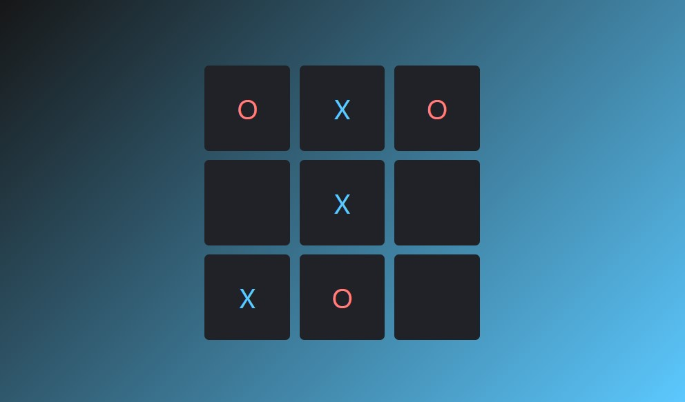

# Tic Tac Toe (TTT)

A game for two players who take turns marking the spaces in a "three-by-three" grid with some marks. The player who succeeds in placing three of their marks in a horizontal, vertical, or diagonal row is the winner!

The number of players and their configuration chan be changed trough [players.json](./players.json)

